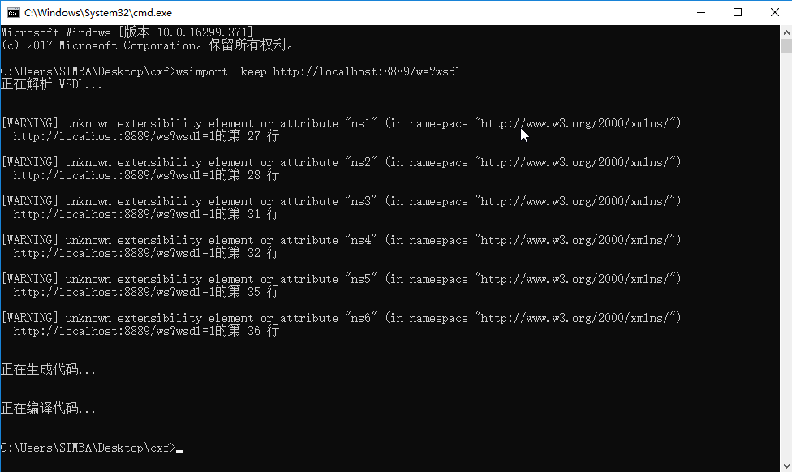
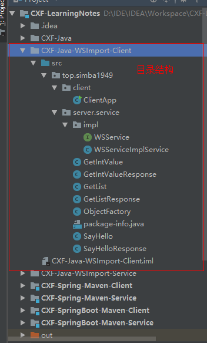
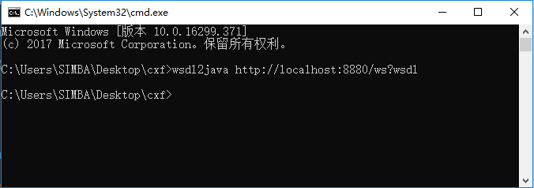
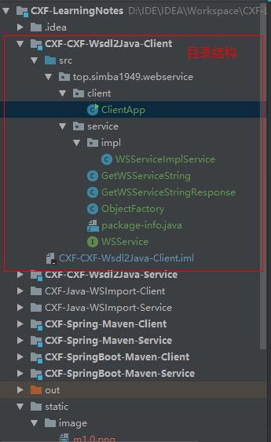
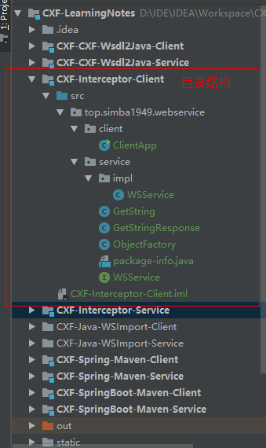
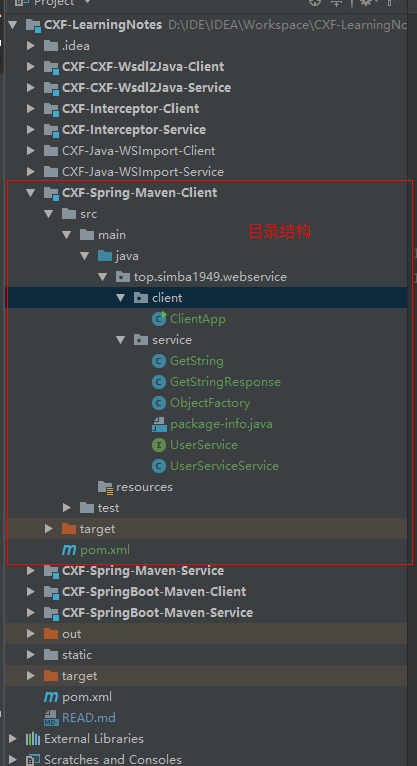
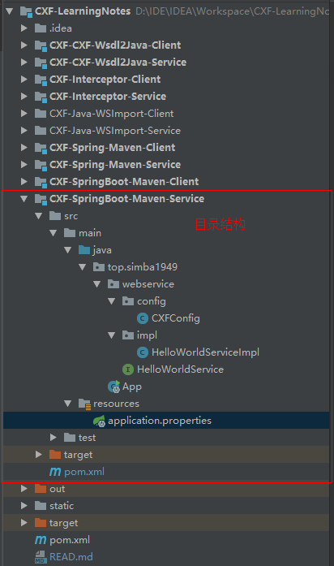
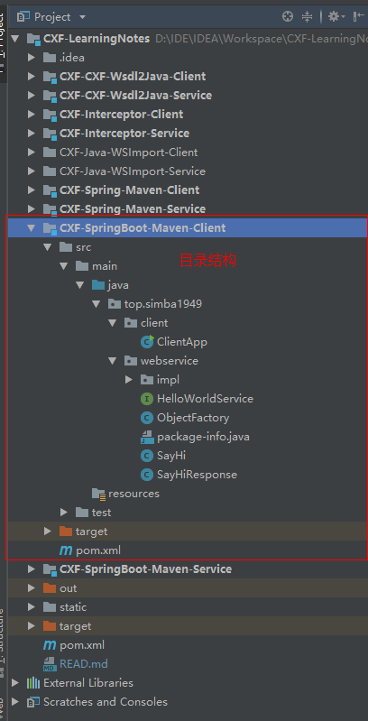

# WebService学习笔记之CXF

## IDE:

* JDK 1.8
* Apache CXF 3.2.4：CXF下载与安装教程：https://blog.csdn.net/simba1949/article/details/80342888

## WebService的调用本质：

1. 客户端把需要调用的参数，转换成XML文档片段（SOAP消息，imput）
2. 客户端通过网络把XML文档片段传给远程服务器
3. 服务器接受XML文档片段
4. 服务器解析XML文档片段，提取其中的数据，并把数据转成调用所需的参数
5. 服务器执行方法
6. 得到方法的返回值，服务器把方法返回值，转换成XML文档片段（SOAP消息,output）
7. 服务器通过网络把XML文档片段传给远程客户端
8. 客户端接受XML文档片段
9. 客户端解析XML文档片段，提取其中的数据，并把数据转成调用返回值

## Wsb Service 的三个技术基础

1. WSDL：Web Service Definition Language

   WSDL 文档：

   ​	①.WebService接口：

   - types 元素：该元素内容就是Schema文档

   - 2N个message元素

   - portType元素：包含N个operation子元素，每个operation元素定义一个WS操作

     ②.WebService实现：

     - binding元素：N个跟详细的operation
     - servi：指定webservice的服务器地址

2. SOAP：Simple Object Access Protocol

3. UDDI：

XML 里的俩个属性：

- targetNamespace：相当于 java 语言中的 package
- xmlns：相当于 java 语言中的 import

## 一、使用 JDK 实现简单 WebService 案例

### 使用JDK的开发WebService服务端

模块：CXF-Java

接口：WSService.java

```java
package top.simba1949.server.service;

import javax.jws.WebService;
import java.util.List;

@WebService
public interface WSService {
    public String sayHello(String name);

    public List<String> getList();

    public int getIntValue(int intValue);
}
```

实现类：WSServiceImpl.java

```java
package top.simba1949.server.service.impl;

import top.simba1949.server.service.WSService;

import javax.jws.WebService;
import java.util.ArrayList;
import java.util.List;

/**
 * @WebService(endpointInterface = "top.simba1949.server.service.WSService")
 * endpointInterface 接口的全限定名
 */
@WebService(endpointInterface = "top.simba1949.server.service.WSService")
public class WSServiceImpl implements WSService {

        public String sayHello(String name) {
            return "Hi @" + name;
        }

        public List<String> getList() {
            List<String> list = new ArrayList<String>();
            list.add("libai");
            list.add("dufu");
            list.add("baijuyi");
            return list;
        }

        public int getIntValue(int intValue) {
            return intValue;
        }

}
```

服务发布：ServerApp.java

```java
package top.simba1949.server;

import top.simba1949.server.service.impl.WSServiceImpl;

import javax.xml.ws.Endpoint;

public class ServerApp {
    public static void main(String[] args) {
        System.out.println("WebService 服务发布开始");
        Endpoint.publish("http://localhost:8889/ws",new WSServiceImpl());
        System.out.println("WebService 服务发布完成");
    }
}
```

### 使用用JDK中的wsimport命令开发客户端

（模块：CXF-Java-WSImport-Service,CXF-Java-WSImport-Client）

使用JDK自带的wsimport命令生成客户端代码，如图



将生成的代码拷贝，目录结构如图



创建客户端：ClientApp.java

```java
package top.simba1949.client;

import top.simba1949.server.service.impl.WSService;
import top.simba1949.server.service.impl.WSServiceImplService;

/**
 * 客户端调用
 */
public class ClientApp {
    public static void main(String[] args) {
        // 创建WSServiceImplService对象
        WSServiceImplService service = new WSServiceImplService();
        // 创建一个代理对象WSService，代理对象即为服务端WWService对象
        WSService proxyService = service.getWSServiceImplPort();
        // 使用代理对象调用WWService的方法
        System.out.println(proxyService.getIntValue(1));
        System.out.println(proxyService.getList());
        System.out.println(proxyService.sayHello("China"));
    }
}
```

## 二、使用 CXF 开发Web Service步骤

### 使用 CXF 开发 Web Service 服务器端：

每个Web Service组件需要2个部分：接口和实现类

1. 开发一个 Web Service 业务接口，该接口要使用 @WebService 注解修饰
2. 开发一个 Web Service  业务接口的实现类，该实现类要是使用 @WebService 注解修饰
3. 发布 WebService 

### 使用 CXF 开发 Web Service 客户端：

1. 调用 CXF 提供的 wsdl2java 工具，根据 wsdl 文档生成相应的 java 代码。

   WSDL - web service definition language

   任何语言实现了 Web Service ，都需要提供、并暴露 WSDL 文档

2. 找到 wsdl2java 所生成类中，一个继承了 Service 的类，该类的实例可以当成工厂使用

3. 调用 Service 子类的实例的 getXxxPort() 方法，返回远程web service的代理

## 三、CXF实现WebService案例

### 服务端（模块：CXF-CXF-Wsdl2Java-Service）

接口：WSService.java

```java
package top.simba1949.webservice.service;

import javax.jws.WebService;

@WebService
public interface WSService {
    public String getWSServiceString(String name);
}
```

实现类：WSServiceImpl.java

```java
package top.simba1949.webservice.service.impl;

import top.simba1949.webservice.service.WSService;

import javax.jws.WebService;

@WebService(endpointInterface = "top.simba1949.webservice.service.WSService")
public class WSServiceImpl implements WSService {
    @Override
    public String getWSServiceString(String name) {
        return "WSServiceImpl @" + name;
    }
}
```

服务发布：ServerApp.java

```java
package top.simba1949;

import org.apache.cxf.jaxws.EndpointImpl;
import top.simba1949.webservice.service.impl.WSServiceImpl;

public class ServerApp {
    public static void main(String[] args) {
        System.out.println("服务发布开始");
        EndpointImpl.publish("http://localhost:8880/ws",new WSServiceImpl());
        System.out.println("服务发布完成");
    }
}
```

### 客户端（模块：CXF-CXF-Wsdl2Java-Client）

使用CXF命令生成客户端代码，如图



将生成的代码拷贝，目录结构如图



创建客户端：ClientApp.java

```java
package top.simba1949.webservice.client;

import top.simba1949.webservice.service.WSService;
import top.simba1949.webservice.service.impl.WSServiceImplService;

public class ClientApp {
    public static void main(String[] args) {
        WSServiceImplService service = new WSServiceImplService();
        // proxyService 是代理service
        WSService proxyService = service.getWSServiceImplPort();
        System.out.println(proxyService.getWSServiceString("LiBai"));
    }
}
```

## 四、实现CXF的权限控制

### 服务端（模块：CXF-Interceptor-Service）

接口：WSService.java

```java
package top.simba1949.webservice.service;

import javax.jws.WebService;

@WebService
public interface WSService {
    public String getString(String name);
}
```

实现类：WSServiceImpl.java

````java
package top.simba1949.webservice.service.impl;

import top.simba1949.webservice.service.WSService;

import javax.jws.WebService;

@WebService(serviceName = "wSService",
        targetNamespace = "http://impl.service.webservice.simba1949.top",
        endpointInterface = "top.simba1949.webservice.service.WSService")
public class WSServiceImpl implements WSService {
    @Override
    public String getString(String name) {
        return null;
    }
}
````

发布服务：CXFServer.java

```java
package top.simba1949;

import org.apache.cxf.interceptor.LoggingInInterceptor;
import org.apache.cxf.interceptor.LoggingOutInterceptor;
import org.apache.cxf.jaxws.EndpointImpl;
import top.simba1949.webservice.service.impl.WSServiceImpl;

import javax.xml.ws.Endpoint;

/**
 * 注意：EndpointImpl 是 apache jar下的类：org.apache.cxf.jaxws.EndpointImpl;
 * Endpoint 是jdk中类：javax.xml.ws.Endpoint;
 */
public class CXFServer {
    public static void main(String[] args) {
        Endpoint endpoint = Endpoint.publish("http://localhost:8881/ws", new WSServiceImpl());
        EndpointImpl endpointImpl = (EndpointImpl) endpoint;

        // 添加日志拦截器
        //如果没有指定路径，默认在控制台输出
        endpointImpl.getInInterceptors().add(new LoggingInInterceptor());
        endpointImpl.getOutInterceptors().add(new LoggingOutInterceptor());

        //指定路径
        /*
        endpointImpl.getInInterceptors().add(new LoggingInInterceptor("D:/in.txt"));
        endpointImpl.getOutInterceptors().add(new LoggingOutInterceptor("D:/out.txt"));
        */
    }
}
```

### 客户端（模块：CXF-Interceptor-Client）

拷贝由wsdl2java生成的代码，目录如图示：



ClientApp.java

```java
package top.simba1949.webservice.client;

import top.simba1949.webservice.service.impl.WSService;

public class ClientApp {
    public static void main(String[] args) {
        WSService wsService = new WSService();
        top.simba1949.webservice.service.WSService proxyService = wsService.getWSServiceImplPort();
        System.out.println(proxyService.getString("66666666"));
    }
}
```

## 五、CXF和Spring整合

### 服务端（模块 CXF-Spring-Maven-Service）

pom.xml

```xml
<?xml version="1.0" encoding="UTF-8"?>
<project xmlns="http://maven.apache.org/POM/4.0.0"
         xmlns:xsi="http://www.w3.org/2001/XMLSchema-instance"
         xsi:schemaLocation="http://maven.apache.org/POM/4.0.0 http://maven.apache.org/xsd/maven-4.0.0.xsd">
    <modelVersion>4.0.0</modelVersion>

    <groupId>top.simba1949</groupId>
    <artifactId>CXF-Spring-Maven-Service</artifactId>
    <version>1.0-SNAPSHOT</version>

    <properties>
        <!-- Spring 版本 -->
        <spring.version>4.3.9.RELEASE</spring.version>
        <!-- cxf 版本 -->
        <cxf.version>3.1.11</cxf.version>
    </properties>
    <dependencies>
        <!-- spring start -->
        <dependency>
            <groupId>org.springframework</groupId>
            <artifactId>spring-core</artifactId>
            <version>${spring.version}</version>
        </dependency>
        <dependency>
            <groupId>org.springframework</groupId>
            <artifactId>spring-web</artifactId>
            <version>${spring.version}</version>
        </dependency>
        <dependency>
            <groupId>org.springframework</groupId>
            <artifactId>spring-webmvc</artifactId>
            <version>${spring.version}</version>
        </dependency>
        <dependency>
            <groupId>org.springframework</groupId>
            <artifactId>spring-aop</artifactId>
            <version>${spring.version}</version>
        </dependency>
        <dependency>
            <groupId>org.springframework</groupId>
            <artifactId>spring-context-support</artifactId>
            <version>${spring.version}</version>
        </dependency>
        <dependency>
            <groupId>org.springframework</groupId>
            <artifactId>spring-oxm</artifactId>
            <version>${spring.version}</version>
        </dependency>
        <!-- spring end -->

        <!-- cxf start -->
        <dependency>
            <groupId>org.apache.cxf</groupId>
            <artifactId>cxf-rt-frontend-jaxws</artifactId>
            <version>${cxf.version}</version>
        </dependency>
        <dependency>
            <groupId>org.apache.cxf</groupId>
            <artifactId>cxf-rt-transports-http</artifactId>
            <version>${cxf.version}</version>
        </dependency>
        <dependency>
            <groupId>org.apache.cxf</groupId>
            <artifactId>cxf-rt-transports-http-jetty</artifactId>
            <version>${cxf.version}</version>
        </dependency>
        <!-- cxf end -->
        <dependency>
            <groupId>org.apache.geronimo.specs</groupId>
            <artifactId>geronimo-ws-metadata_2.0_spec</artifactId>
            <version>1.1.3</version>
        </dependency>
    </dependencies>
    <build>
        <finalName>webservice</finalName>
        <!--  配置 tomcat插件启动-->
        <plugins>
            <plugin>
                <groupId>org.apache.maven.plugins</groupId>
                <artifactId>maven-compiler-plugin</artifactId>
                <version>2.0.2</version>
                <configuration>
                    <source>1.6</source>
                    <target>1.6</target>
                    <encoding>utf-8</encoding>
                </configuration>
            </plugin>
            <plugin>
                <groupId>org.apache.tomcat.maven</groupId>
                <artifactId>tomcat7-maven-plugin</artifactId>
                <version>2.2</version>
                <configuration>
                    <path>/</path>
                    <port>8081</port>
                    <uriEncoding>UTF-8</uriEncoding>
                </configuration>
            </plugin>
        </plugins>
    </build>
</project>
```

web.xml

```xml
<?xml version="1.0" encoding="UTF-8"?>
<web-app xmlns="http://java.sun.com/xml/ns/javaee"
         xmlns:xsi="http://www.w3.org/2001/XMLSchema-instance"
         xsi:schemaLocation="http://java.sun.com/xml/ns/javaee
          http://java.sun.com/xml/ns/javaee/web-app_2_5.xsd"
         version="2.5">

    <display-name>cxf</display-name>
    <!---->
    <context-param>
        <param-name>contextConfigLocation</param-name>
        <param-value>classpath*:applicationContext.xml,classpath*:applicationContext-cxf.xml</param-value>
    </context-param>
    <listener>
        <listener-class>org.springframework.web.context.ContextLoaderListener</listener-class>
    </listener>

    <!--springmvc-->
    <servlet>
        <servlet-name>dispatcherServlet</servlet-name>
        <servlet-class>org.springframework.web.servlet.DispatcherServlet</servlet-class>
        <init-param>
            <param-name>contextConfigLocation</param-name>
            <param-value>classpath*:applicationContext.xml</param-value>
        </init-param>
        <load-on-startup>1</load-on-startup>
    </servlet>
    <servlet-mapping>
        <servlet-name>dispatcherServlet</servlet-name>
        <url-pattern>/</url-pattern>
    </servlet-mapping>
    <!---->
    <servlet>
        <servlet-name>cxfServlet</servlet-name>
        <servlet-class>org.apache.cxf.transport.servlet.CXFServlet</servlet-class>
        <load-on-startup>1</load-on-startup>
    </servlet>
    <servlet-mapping>
        <servlet-name>cxfServlet</servlet-name>
        <url-pattern>/ws/*</url-pattern>
    </servlet-mapping>
</web-app>
```

applicationContext.xml

```xml
<?xml version="1.0" encoding="UTF-8"?>
<beans xmlns="http://www.springframework.org/schema/beans"
       xmlns:xsi="http://www.w3.org/2001/XMLSchema-instance"
       xmlns:context="http://www.springframework.org/schema/context"
       xsi:schemaLocation="
        http://www.springframework.org/schema/beans http://www.springframework.org/schema/beans/spring-beans.xsd
        http://www.springframework.org/schema/context http://www.springframework.org/schema/context/spring-context.xsd
">
    <!--包扫描-->
    <context:component-scan base-package="top.simba1949"></context:component-scan>

    <import resource="applicationContext-cxf.xml"></import>

</beans>
```

applicationContext-cxf.xml

```xml
<?xml version="1.0" encoding="UTF-8"?>
<beans xmlns="http://www.springframework.org/schema/beans"
       xmlns:xsi="http://www.w3.org/2001/XMLSchema-instance"
       xmlns:jaxws="http://cxf.apache.org/jaxws"
       xsi:schemaLocation="
        http://www.springframework.org/schema/beans http://www.springframework.org/schema/beans/spring-beans.xsd
        http://cxf.apache.org/jaxws http://cxf.apache.org/schemas/jaxws.xsd
">

    <!--
        发布服务
        和使用endpoint发布服务相似
        WebService地址=tomcat地址 + cxfServlet拦截地址 + /address
    -->
    <jaxws:server address="/userService" serviceClass="top.simba1949.webservice.service.UserService">
        <jaxws:serviceBean>
            <ref bean="userServiceImpl"></ref>
        </jaxws:serviceBean>
    </jaxws:server>
</beans>
```

接口：UserService.java

```java
package top.simba1949.webservice.service;

import javax.jws.WebService;

@WebService
public interface UserService {

    public String getString();
}
```

实现类：UserServiceImpl.java

```java
package top.simba1949.webservice.service.impl;

import org.springframework.stereotype.Component;
import top.simba1949.webservice.service.UserService;

@Component("userServiceImpl")
public class UserServiceImpl implements UserService {
    @Override
    public String getString() {
        return "UserServiceImpl";
    }
}
```

### 客户端模块 CXF-Spring-Maven-Client

使用CXF生成代码并拷贝，目录结构如图：



客户端：ClientApp.java

```java
package top.simba1949.webservice.client;

import top.simba1949.webservice.service.UserService;
import top.simba1949.webservice.service.UserServiceService;

public class ClientApp {
    public static void main(String[] args) {
        UserServiceService service = new UserServiceService();
        UserService proxyService = service.getUserServicePort();
        System.out.println(proxyService.getString());
    }
}
```

## 六、CXF和SpringBoot整合

### 服务端（模块：CXF-SpringBoot-Maven-Service）

目录结构如图示：



pom.xml

```xml
<?xml version="1.0" encoding="UTF-8"?>
<project xmlns="http://maven.apache.org/POM/4.0.0"
         xmlns:xsi="http://www.w3.org/2001/XMLSchema-instance"
         xsi:schemaLocation="http://maven.apache.org/POM/4.0.0 http://maven.apache.org/xsd/maven-4.0.0.xsd">
    <modelVersion>4.0.0</modelVersion>

    <groupId>top.simba1949</groupId>
    <artifactId>CXF-SpringBoot-Maven-Service</artifactId>
    <version>1.0-SNAPSHOT</version>

    <parent>
        <groupId>org.springframework.boot</groupId>
        <artifactId>spring-boot-starter-parent</artifactId>
        <version>2.0.3.BUILD-SNAPSHOT</version>
    </parent>

    <properties>
        <project.build.sourceEncoding>UTF-8</project.build.sourceEncoding>
        <project.reporting.outputEncoding>UTF-8</project.reporting.outputEncoding>
        <java.version>1.8</java.version>
    </properties>

    <dependencies>
        <dependency>
            <groupId>org.springframework.boot</groupId>
            <artifactId>spring-boot-starter</artifactId>
        </dependency>
        <dependency>
            <groupId>org.springframework.boot</groupId>
            <artifactId>spring-boot-starter-web</artifactId>
        </dependency>

        <!-- https://mvnrepository.com/artifact/org.apache.cxf/cxf-spring-boot-starter-jaxws -->
        <dependency>
            <groupId>org.apache.cxf</groupId>
            <artifactId>cxf-spring-boot-starter-jaxws</artifactId>
            <version>3.2.4</version>
        </dependency>
    </dependencies>

    <repositories>
        <repository>
            <id>spring-snapshots</id>
            <name>Spring Snapshots</name>
            <url>https://repo.spring.io/libs-snapshot</url>
            <snapshots>
                <enabled>true</enabled>
            </snapshots>
        </repository>
    </repositories>
</project>
```

接口：HelloWorldService.java

```java
package top.simba1949.webservice;

import javax.jws.WebService;

@WebService
public interface HelloWorldService {

    public String sayHi(String name);
}
```

实现类：HelloWorldServiceImpl.java

```java
package top.simba1949.webservice.impl;

import org.springframework.stereotype.Component;
import top.simba1949.webservice.HelloWorldService;

import javax.jws.WebService;

@Component
@WebService(serviceName = "/HelloWorldService",//暴露服务名称
        targetNamespace = "http://impl.webservice.simba1949.top",//命名空间，一般是包名倒序
        endpointInterface = "top.simba1949.webservice.HelloWorldService"//接口的全路径
)
public class HelloWorldServiceImpl implements HelloWorldService {
    @Override
    public String sayHi(String name) {
        return "Hi @" + name;
    }
}
```

配置类：CXFConfig.java

```java
package top.simba1949.webservice.config;

import org.apache.cxf.Bus;
import org.apache.cxf.jaxws.EndpointImpl;
import org.springframework.beans.factory.annotation.Autowired;
import org.springframework.context.annotation.Bean;
import org.springframework.context.annotation.Configuration;
import top.simba1949.webservice.HelloWorldService;

import javax.xml.ws.Endpoint;

@Configuration
public class CXFConfig {

    @Autowired
    private Bus bus;

    @Autowired
    HelloWorldService helloWorldService;

    @Bean
    public Endpoint endpoint(){
        EndpointImpl endpoint = new EndpointImpl(bus,helloWorldService);
        endpoint.publish("/HelloWorldService");

        return endpoint;
    }
}
```

启动类：App.java

```java
package top.simba1949;

import org.springframework.boot.SpringApplication;
import org.springframework.boot.autoconfigure.SpringBootApplication;

@SpringBootApplication
public class App {
    public static void main(String[] args) {
        SpringApplication.run(App.class);
    }
}
```

资源配置：application.perperties

```properties
#cxf.path默认值为/service
cxf.path=/ws
#springboot中的服务器端口
server.port=8888
```

### 客户端（模块：CXF-SpringBoot-Maven-Client）

使用CXF生成代码并拷贝，目录结构如图示：



客户端：ClientApp.java

````java
package top.simba1949.client;

import top.simba1949.webservice.HelloWorldService;
import top.simba1949.webservice.impl._002fHelloWorldService;

public class ClientApp {
    public static void main(String[] args) {
        _002fHelloWorldService service = new _002fHelloWorldService();
        HelloWorldService proxyService = service.getHelloWorldServiceImplPort();
        System.out.println(proxyService.sayHi("55"));
    }
}
````


